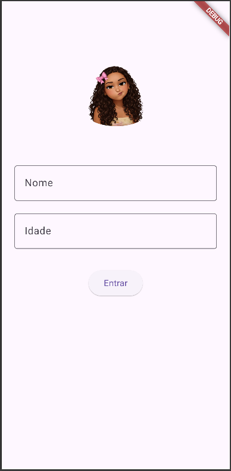
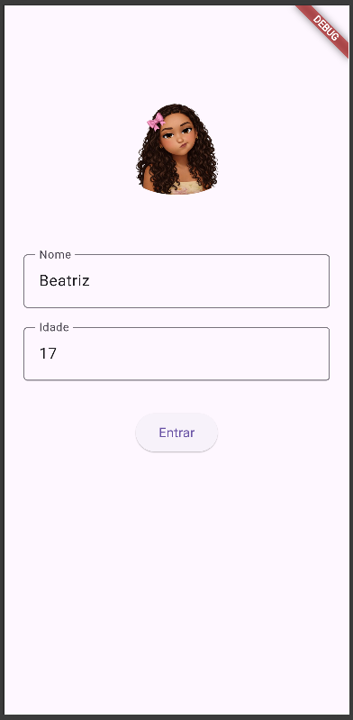
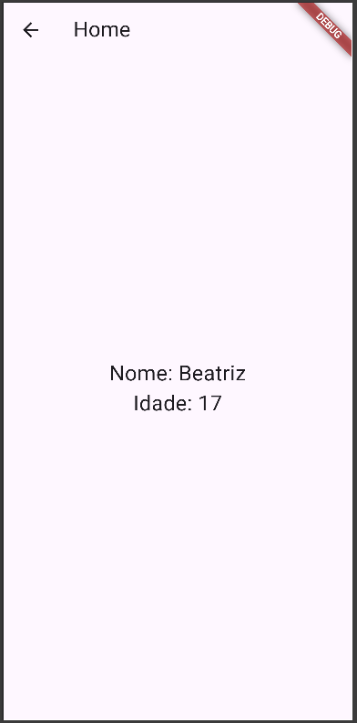

# Splash Atividade 2026

Exemplo de uma Splash Screen com animação de entrada de imagem e navegação entre telas com Flutter, incluindo passagem de dados do usuário.

---

## Tecnologias

- Flutter
- Dart
- VS Code

---

##  Funcionalidades

- Splash com animação (imagem descendo do topo até o centro)
- Campo para digitar nome
- Campo para digitar idade
- Botão para navegação
- Passagem de dados entre telas
- Transição de tela com efeito de fade

---

##  Efeitos / Widgets

| Efeito                         | Widget / Recurso             |
|--------------------------------|------------------------------|
| Movimento (animação)           | Transform.translate          |
| Animação controlada            | AnimationController          |
| Curva de animação              | CurvedAnimation              |
| Atualização dinâmica           | AnimatedBuilder              |
| Imagens locais                 | Image.asset()                |
| Entrada de texto               | TextField                    |
| Navegação entre telas          | Navigator.push               |
| Transição personalizada        | PageRouteBuilder             |
| Fade (transparência)           | FadeTransition               |

---

##  Estrutura

```bash
lib/
 ├── main.dart
 ├── splash.dart
 └── home.dart
assets/
 └── foto.png
```

##  Screenshots

### Splash Screen


### Formulário


### Home


## Rodar rapidamente

```bash
git clone "link"
abra a pasta
flutter pub get
flutter run -d chrome