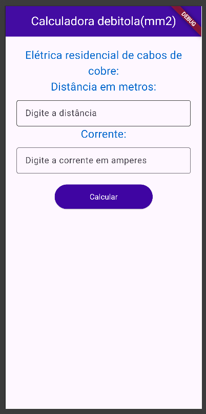
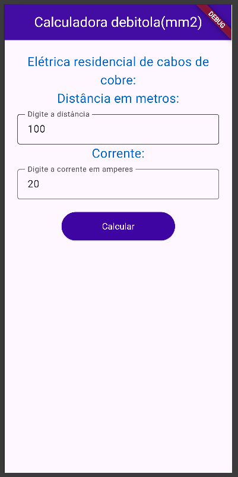
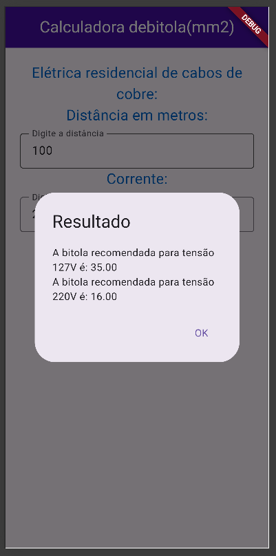

#  Bitola de Fios 2026

---

##  Sobre o projeto

O **Bitola de Fios** é um aplicativo desenvolvido para auxiliar no dimensionamento correto de condutores elétricos em instalações.

A aplicação foi criada com base nos conceitos ensinados em instalações elétricas, permitindo calcular a bitola adequada do fio de acordo com as condições informadas.

O usuário informa:

* Corrente elétrica (A)
* Distância do circuito (m)

E o sistema retorna:

* Bitola do fio para 110V
* Bitola do fio para 220V

---

##  Prints das telas

<p align="center">
  
  
  
</p>

---

##  Funcionalidades

*  Cálculo da bitola do fio
*  Suporte para 110V e 220V
*  Consideração da distância do circuito
*  Interface simples e funcional

---

##  Tecnologias utilizadas

* Flutter
* Dart

---

##  Como executar o projeto

```bash id="bit123"
git clone https://github.com/biaams-sys/bitola2026.git
```
terminal do vscode
```
flutter pub get
flutter run
```

---

##  Estrutura do projeto

```id="bitstruct"
Bitola2026/
├── assets/
│   ├── tela1.png
│   ├── tela2.png
│   └── tela3.png
├── lib/
│   ├── main.dart
├── pubspec.yaml
└── README.md
```

---

##  Aprendizados

* Aplicação de conceitos de instalações elétricas
* Cálculo de dimensionamento de condutores
* Desenvolvimento de interfaces no Flutter
* Organização de projetos

---

##  Autora

Beatriz Albuquerque 💗
